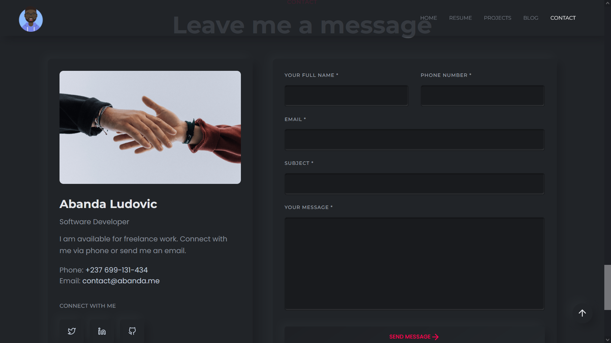

# 👷 `Worker Email`

A Cloudflare worker script to handle form data and send email to website admin. This serves as a backend to send user messages from a contact form on a website to the admin email address.



Cloudflare worker is a free service that can be used to run lightweight scripts in order to enhance the functionality of your static websites. For more information about Cloudflare Workers visit [https://workers.cloudflare.com/](https://workers.cloudflare.com/)

[`index.js`](./index.js) is the content of the Workers script.


## Setup

### Prerequisites
1. [Cloudflare account](https://cloudflare.com/). 

2. Mailgun account. Create an account at [mailgun.com](https://www.mailgun.com/). A free trial version is available, this is all you need to test this script. Make sure to register your `admin email` as one of the receiving emails if you are using the trial (sandox) version.

3. [Github account](https://github.com/) (optional)

4. ⭐ Star the project if you find it helpful.

### Clone 
To use this project you will need to clone or download it. 

### Install wrangler
This project is built using [Cloudflare Wrangler](https://developers.cloudflare.com/workers/get-started/guide/). You will need it to build, test and deploy the script.

### Setup Wrangler
With installation complete, wrangler will need access to a Cloudflare OAuth token to manage Workers resources on your behalf.

Run the command wrangler login, which will automate this process.

Wrangler will attempt to automatically open your web browser to complete the login process to your Cloudflare account. If you have issues completing this step or you do not have access to a browser GUI, you can copy and paste the URL generated by wrangler login in your terminal into a browser and log in

`$ wrangler login`

### Initialize the project
Create a skeleton wrangler.toml in the project directory. This will initialize the project and prepare it for deployment.
```$ wrangler init worker-email --type=webpack
```

A file named `wrangler.toml` will be generated. This where all you configurations will be found.

### Setup environment variables
Copy the environment variables bellow and paste them at the end of the file `wrangler.toml`

```
[vars]
MAILGUN_KEY = "........................................."
MAILGUN_DOMAIN = "sandbox...................mailgun.org"
ADMIN_EMAIL = "adminemail"
ALLOWED_ORIGIN = "yourdomain.xyz"
LOGO_URL = "xyz.com/assets/logo.png" 
FROM = "ABCD <noreply@abc.xyz>"
```

Replace their values as required.

Use the `wrangler-copy.toml` file as a sample.
#### Test the project
In order to preview your Worker, you need to configure your project by adding your `Account ID` to your project’s `wrangler.toml` file

Run the command `$ wrangler whoami` and copy your `Account ID` to

```
account_id = "............................"
workers_dev = true
```

Again, use the `wrangler-copy.toml` file as a sample

You can now test the script locally by running
`$ wrangler dev`

Your app will probably be served through `http//127.0.0.1:8787`

Send a post request to 
```
http//127.0.0.1:8787/contact

with body = {
    name: "Some name",
    phone: "Some phone number",
    email: "Some email",
    subject: "Some subject",
    message: "Some message",
    eml2: ""
}
```

Make sure the `origin` sending the post request is same as the `environment variable ALLOWED_ORIGIN`. This script tries to fight against CORS attacks

If you are using trial (sandbox) version of `Mailgun` make sure to register your `ADMIN_EMAIL` as one of the receiving emails.
### Deploy your script
With your project configured, you can now publish your Worker.

To deploy to your *.workers.dev subdomain, run:
```$ wrangler publish
```

## Helpful resources
[Cloudflare Workers Guide](https://developers.cloudflare.com/workers/get-started/guide/)
[Mailgun Free Account](https://signup.mailgun.com/new/signup)
[Mailgun Sandbox Tutorial](https://mailtrap.io/blog/mailgun-sandbox-tutorial/)
